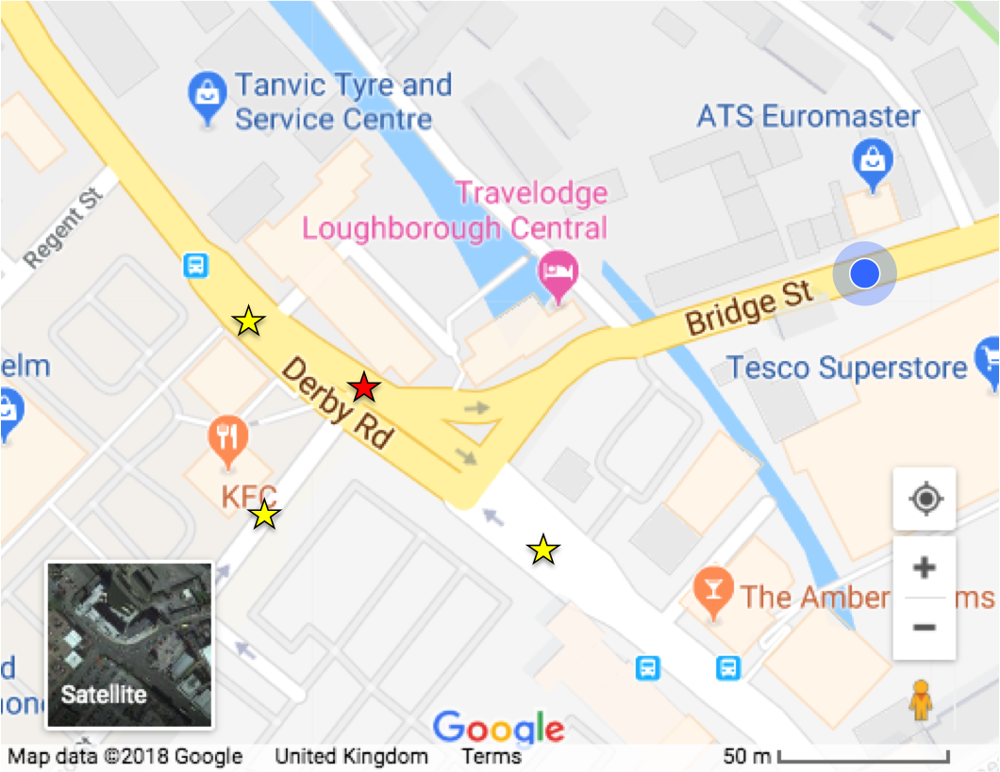

# STC25-React-Native
An implementation of an extendible STC25 form with native iOS and Android app support and InfoNet and ICM update routines

## Planned User Experience

The surveyor will be provided with a google map displaying his/her current location and a standard GIS layer provided by the Consultant:



GIS layers provided will be able to be customised to the Consultant's requirements, but it is suggested that there is a theme for surveyors such that sites are flagged as `High`, `Medium` or `Low` risk, as organised by the Consultant and Surveyor.

> Note: It may be possible for us to create a 'travelling salesman' path for the surveyor, but this is only a proposed long term feature. 

The surveyor will be able to survey manholes by clicking on the manhole in the map.

Upon clicking a manhole, the manhole form will be opened. Useful information like current GPS position will be added to the form by default.

The surveyor is then given a list of fields to input data to. This set of fields by default will be STC25 spec, however this can be user defined by the consultant to better fit their purposes.

When the surveyor has completed the requested form, the form will be wrapped up in a JSON file and attached to an email sent to a specified email address. The subject of the email will include the project name, the node reference, coordinates and version. E.G.

```
Northern_Water_Surveys-SO12345678-X:123456;Y:987654-v1.json
```

> Note: All of this information will be customisable, including the ability to encrypt emailed survey data.

The JSON file will then be able to be sense-checked, printed to an STC25 form, imported into sewer management systems e.g. InfoNet and imported into hydraulic simulation software e.g. InfoWorks ICM.

The consultant may choose whether information received should be sent 'live' as described, or after the survey has been completed. It is suggested that emails should be sent live, such that the responsible authority can scrutinise the data and message the surveyor immediately if any problems/mistakes arise. 

## Planned Structure

### Defining a form

A form will be defined from an array of JS objects such as the following:

```js
export [
  {
    type:"group",
    color:"#b7ffdc",
    children:[
      {
        //'this' relates to survey object data provided by the consultant.
        "name":"NODE REFERENCE",
        "enabled":true,
        "overridable":false,
        "default":function(current){return this.node_id}
      },{
        "name":"EASTINGS",
        "enabled":false,
        "overridable":false,
        "default":function(current){return current.Eastings},
        "reset":function(formData,current){
          formData.EASTINGS = current.Eastings;
          formData.NORTHINGS = current.Northings;
          return formData;
        }
      },{
        "name":"NORTHINGS",
        "enabled":false,
        "overridable":false,
        "default":function(current){return current.Northings},
        "reset":function(formData,current){
          formData.EASTINGS = current.Eastings;
          formData.NORTHINGS = current.Northings;
          return formData;
        }
      },{
        "name":"SURVEY DATE",
        "enabled":false,
        "overridable":false,
        "default":function(current){return current.date}
      },{
        "name":"DRAINAGE AREA CODE",
        "enabled":false,
        "default":function(current){return this.code},
      },{
        "name":"LOCATION",
        "default":function(current){this.location},
        "type":"String",
        "validation":function(data){
          if(!/(.+),/.test(data) && data <> this.location){
            return "This is not a valid location."
          }
        }
      },{
        //Example of a date
        "name":"YEAR LAID",
        "type":"Date"
      },{
        //Example of a float
        "name":"DEPTH",
        "type":"Float"
      }
    ]
  },{
    type:"group",
    color:"#c9f9ff"
    children:[
      {
        "name":"UPSTREAM PIPES",
        "type":"Table",
        "fields":[
          {name:"ID", enabled:false,default:function(){return "ABCDEFGHIJKLMNO"[this.rowid]}},
          {name:"UPSTREAM REFERENCE", type:"String"},
          {name:"PIPE SHAPE", type:"Choices", choices:[
            "Circular","Rectangular","Triangular"]
          },
          {name:"PIPE SIZE (mm)", type:"Size(2)"},
          {name:"BACKDROP DIAM (mm)", type:"String"},
          {name:"PIPE MATERIAL", type:"Choices",
            choices:[
              "Vitrified Clay", "Brick", "Plastic", "Copper", "Steel", "Other"
            ]
          },
          {name:"LINING MATERIAL", type:"String"},
          {name:"DEPTH FROM COVER (m)", type:"Float"},
          {name:"INVERT LEVEL", type:"Float"}
        ]
      }
    }
  ]
```

A description of the proposed properties is given in the table below:

| Field       | Type     | Default | Description 
| -----       | -------- | ------- | ----------- 
| name        | String   | N/A     | The name of the field 
| type        | String   | null    | The control type of a field 
| default     | Any      | null    | The default value of a field. If this is a function, then an it is passed an argument `current` which contains information about the current location, if the phone has GPS enabled.
| enabled     | Boolean  | true    | Whether it is possible to write information into a field
| overridable | Boolean  | true    | An overridable field is possible to change even if the field is disabled, but it will trigger a caution to the contractor that the field was altered 
| reset       | Function | null    | If this is added to the field, a reset button is added next to the field. Good for automated routines. 
| validation  | Function | null    | A function which executes on the element when it is modified. If the function returns text then the validation error will display to the surveyor. This will not prevent the form from being submitted unless explicitely defined in the app options.
| visible     | Boolean  | true    | Whether the element is visible or not. Invisible elements will be added to the final data structure, but can be automated completely.
| style       | String   | ""      | The CSS style applied to the element
| meta        | Object   | null    | Any extra metadata that you might want to store in a particular field.

A list of available control types is listed below:

| Type        | Description 
| -----       | ----------- 
| null        | An input box to a 1 line string
| String      | An input box to a 1 line string
| Notes       | A full text editor with ability to add images to text
| Float       | An input box to a floating point number
| Date        | A control which allows you to select/type a date
| Size(n)     | A control which lists n Floats like ### x ### x ... x ###
| Choices     | A control which lists a set of choices for the user to pick from. The user may type an item which is not in the list.
| Table       | A control which lists other controls in a table format. New lines can be freely added to and removed from the table.
| Group       | Holds controls, useful for color coding groups of controls.